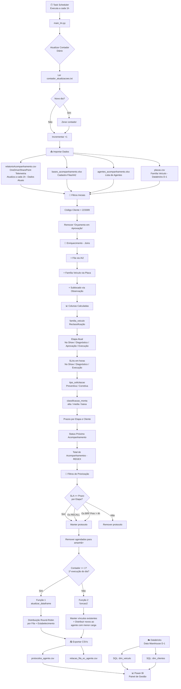

# Gestor de Filas Acompanhamento LM

## 📋 Visão Geral do Negócio

Sistema automatizado de **gestão de filas de acompanhamento de manutenção veicular** para o cliente **LOCADORA VW/LM - TGM** (Código 223309) da **Edenred/Ticket Log**. O sistema processa protocolos de manutenção preventiva e corretiva, calcula SLAs por etapa, classifica prioridades e distribui os protocolos entre os agentes de acompanhamento de forma equitativa.

### Objetivo de Negócio
Garantir que cada veículo em manutenção seja acompanhado dentro dos prazos contratuais (SLA), distribuindo a carga de trabalho de forma equilibrada entre os analistas e priorizando protocolos críticos (atrasados, sem acompanhamento, fora do prazo).

### Contexto Operacional
- **Turno 1**: Antes das 12h00
- **Turno 2**: Após 12h00
- Feriados nacionais brasileiros são considerados no cálculo de prazos
- O sistema roda via **Task Scheduler** do Windows de hora em hora, alinhado com a atualização da fonte de dados

---

## 🏗️ Arquitetura e Fontes de Dados

### Fontes de Dados

| Fonte | Tipo | Frequência | Descrição |
|-------|------|------------|-----------|
| **relatorioAcompanhamento.csv** | CSV (OneDrive/SharePoint Telemetria) | Atualização de hora em hora (dados atuais) | Dados de protocolos de acompanhamento em tempo real. Reside na pasta compartilhada do usuário de serviço Telemetria JBS, administrada por outra equipe. **Não vem do Databricks.** |
| **bases_acompanhamento.xlsx** | Excel (local) | Manual | Cadastro de clientes com informação da Fila e IA2 (Informação Adicional 2) |
| **agentes_acompanhamento.xlsx** | Excel (local) | Manual | Lista de colaboradores/agentes disponíveis por fila |
| **placas.csv** | CSV (local) | Originada do Databricks (D-1) | Relação placa → família de veículo (ex: Caminhão, Leve, Moto etc.) — consulta SQL `dim_veiculo` |
| **Databricks** | Data Warehouse (SQL) | D-1 (dia anterior) | Fornece as tabelas **dim_veiculo** e **dim_clientes** usadas na modelagem Power BI. Os dados do Databricks são D-1, não em tempo real |

### Fluxo de Dados Resumido

```
OneDrive/SharePoint (Telemetria)     Databricks (D-1)
        │                                   │
        │ relatorioAcompanhamento.csv        │ SQL → dim_veiculo, dim_clientes
        │ (atualiza a cada 1h)               │
        ▼                                   ▼
   ┌─────────────────┐            ┌──────────────────┐
   │  main_lm.py     │◄───────── │  placas.csv       │
   │  (Python ETL)   │           │  (do Databricks)  │
   │                 │◄───────── └──────────────────┘
   │                 │
   │                 │◄───── bases_acompanhamento.xlsx
   │                 │◄───── agentes_acompanhamento.xlsx
   └────────┬────────┘
            │
            ▼
   ┌─────────────────────┐
   │ protocolos_agente.csv│──────────► Power BI
   │ relacao_fila_ec_     │           (Painel de Gestão)
   │   agente.csv         │
   └─────────────────────┘
```

---

## 📂 Estrutura de Arquivos

```
Gestor de Filas Acompanhamento LM/
├── main_lm.py                          # Script Python principal (ETL + distribuição)
├── atualizador.py                      # Watchdog: monitora CSV e re-executa quando alterado
├── gestor_filas_acompanhamento_LM.ipynb # Notebook Jupyter (mesma lógica do main_lm.py)
├── README.md                           # Esta documentação
├── arquivos_auxiliares/
│   ├── contador_atualizacoes.txt        # Contador diário de execuções (formato: YYYY-MM-DD,N)
│   ├── relacao_fila_ec_agente.csv       # Mapeamento Fila → Agente → Código Estabelecimento
│   └── (versões de backup com sufixo da máquina)
├── arquivos_gestao/
│   ├── bases_acompanhamento.xlsx        # Cadastro de clientes/filas (sheet: informacao_adicional)
│   ├── agentes_acompanhamento.xlsx      # Lista de agentes (sheet: lista_colaboradores)
│   └── placas.csv                       # Relação placa ↔ família veículo (origem: Databricks)
└── arquivos_painel/
    └── protocolos_agente.csv            # Saída final consumida pelo Power BI
```

### Papel de Cada Arquivo

| Arquivo | Função |
|---------|--------|
| **main_lm.py** | Script principal. Lê os dados, transforma, calcula SLAs, classifica prioridades, filtra protocolos relevantes e distribui entre agentes. Gera os arquivos de saída para o Power BI |
| **atualizador.py** | Usa a lib `watchdog` para observar mudanças no `relatorioAcompanhamento.csv`. Quando detecta modificação, executa o notebook via `nbconvert` |
| **gestor_filas_acompanhamento_LM.ipynb** | Versão Jupyter Notebook da mesma lógica do main_lm.py, usada para desenvolvimento e testes interativos |
| **contador_atualizacoes.txt** | Persiste `YYYY-MM-DD,N` para rastrear quantas vezes o script rodou no dia. Zera automaticamente ao mudar de dia |
| **relacao_fila_ec_agente.csv** | Persistência do mapeamento agente↔estabelecimento para manter consistência entre execuções |
| **protocolos_agente.csv** | Saída final — cada protocolo com todas as colunas calculadas e o agente atribuído. Consumido pelo Power BI |
| **placas.csv** | Dados D-1 do Databricks: `LicensePlate` e `MaintenanceModelFamily` |
| **relatorioAcompanhamento.csv** | **Não está neste repositório.** Reside no OneDrive/SharePoint de Telemetria. Atualiza de hora em hora com dados atuais |

---

## ⚙️ Lógica Técnica do Python (main_lm.py)

### 1. Contador de Atualizações Diárias

```python
# Arquivo: arquivos_auxiliares/contador_atualizacoes.txt
# Formato: "YYYY-MM-DD,N"  (ex: "2026-02-16,7")
```

- **`ler_dados()`**: Lê dia e contador do arquivo. Retorna `(None, 0)` se não existir
- **`escrever_dados(dia, contador)`**: Salva dia e contador no arquivo
- **`atualizar_contador()`**: Se o dia mudou, zera o contador; sempre incrementa +1
- **`obter_contagem_atualizacoes_dia()`**: Retorna o contador atual sem incrementar
- **Propósito no negócio**: O `contador_atual` define qual função de distribuição usar:
  - **Contador == 1** (primeira execução do dia): Executa `atualizar_dataframe()` (Função 1) — redistribui todos os protocolos do zero
  - **Contador > 1** (execuções seguintes): Executa `funcao2()` — só distribui protocolos novos, mantendo vínculos anteriores

### 2. Importação e Filtros Iniciais

| Etapa | Detalhe |
|-------|---------|
| Leitura do CSV | `pd.read_csv(caminho_acompanhamento, encoding='ISO-8859-1', sep=';')` — o caminho é resolvido dinamicamente via `os.environ['USERPROFILE']` |
| Seleção de colunas | 24 colunas relevantes (Protocolo, Placa, Cliente, Datas, Status, etc.) |
| Filtro por cliente | `Código Cliente == 223309` (LOCADORA VW/LM - TGM) |
| Filtro de status | Remove `Status do Protocolo == 'Orçamento em Aprovação'` |

### 3. Enriquecimento de Dados (Joins)

| Join | Fonte | Chave | Coluna Trazida |
|------|-------|-------|----------------|
| Fila do cliente | `bases_acompanhamento.xlsx` → `informacao_adicional` | `Informação Adicional 2 = IA 2` | `Fila` |
| Família do veículo | `placas.csv` | `Placa = LicensePlate` | `MaintenanceModelFamily` |

### 4. Colunas Calculadas

#### 4.1 Coluna `Sublocado`
```python
# Se Observação == 'SIM' → 'SIM'; senão → None
df['Sublocado'] = df['Observação'].apply(lambda x: 'SIM' if x == 'SIM' else None)
```
**Negócio**: Identifica veículos sublocados (pertencentes a terceiros sob gestão LM).

#### 4.2 Correções de Fila
Regras de reclassificação:
- **ICOMON - Sinistro**: Se IA2 é `ICOMON`, `CSR` ou `CSR ENGENHARIA LTDA` E o tipo de manutenção é `Sinistro` ou `Sinistro LM`
- **RECALL**: Se Código Estabelecimento = `8725675` OU Nome Estabelecimento = `OFICINA INTERNA PLATAFORMA ECOFROTAS3`
- Remove protocolos sem Fila atribuída (`Fila.notna()`)

#### 4.3 Conversão de Tipos
- **Datas**: `Data Agendada`, `Data da Parada`, `Data Primeiro Envio da OS`, `Data Aprovação da OS`, `Próximo Acompanhamento` → `datetime` (formato `%d/%m/%Y %H:%M:%S`)
- **Valor OS**: Remove `R$`, troca `.` → `""`, troca `,` → `.`, converte para `float`
- **Códigos**: Protocolo, Cliente e Estabelecimento → `object`

#### 4.4 Coluna `familia_veiculo`
Reclassificação com `np.where` encadeado da `MaintenanceModelFamily`:

| MaintenanceModelFamily (contém) | familia_veiculo |
|--------------------------------|-----------------|
| Caminhao Pesado | Caminhao Pesado |
| Caminhao | Caminhao |
| Pickup Pesada | Pickup Pesada |
| Pickup Media | Pickup Media |
| Pickup Leve | Pickup Leve |
| Van | Van |
| Moto | Moto |
| Leve | Leve |
| Equipamento | Equipamento |
| Implemento, Onibus, Reboque, Micro Onibus | Caminhao |
| Suv | Pickup Pesada |
| Quadriciclo | Moto |
| Utilitario | Van |
| (default) | Leve |

#### 4.5 Coluna `Etapa Atual`
```python
def definir_etapa(row):
    if pd.isna(row['Data da Parada']):       return 'No Show'
    elif pd.isna(row['Data Primeiro Envio']): return 'Diagnóstico'
    elif pd.isna(row['Data Aprovação']):      return 'Aprovação'
    else:                                      return 'Execução do serviço'
```
**Negócio**: Determina em qual fase do fluxo de manutenção o protocolo se encontra:
- **No Show**: Veículo agendado mas não deu entrada na oficina
- **Diagnóstico**: Veículo na oficina, aguardando orçamento  
- **Aprovação**: Orçamento enviado, aguardando aprovação do cliente
- **Execução do serviço**: Serviço aprovado, em execução

#### 4.6 Colunas SLA (em horas)
| SLA | Fórmula | Quando se aplica |
|-----|---------|-----------------|
| `SLA No Show` | `(hora_atual - Data Agendada) / 3600` | Etapa = No Show |
| `SLA Diagnóstico` | `(hora_atual - Data da Parada) / 3600` | Etapa = Diagnóstico |
| `SLA Execução` | `(hora_atual - Data Aprovação da OS) / 3600` | Etapa = Execução do serviço |

Todas arredondadas para 1 casa decimal.

#### 4.7 Coluna `tipo_solicitacao`
```python
'Manutenção Preventiva' → 'Preventiva'
(qualquer outro)        → 'Corretiva'
```

#### 4.8 Coluna `classificacao_monta` (Porte do Serviço)
Classificação baseada em `familia_veiculo` × `Valor OS`:

| familia_veiculo | Alta Monta (>) | Média Monta | Baixa Monta (≤) |
|----------------|----------------|-------------|-----------------|
| Caminhão Pesado | > R$ 35.000 | R$ 15.000 – R$ 35.000 | ≤ R$ 15.000 |
| Caminhão | > R$ 15.000 | R$ 5.000 – R$ 15.000 | ≤ R$ 5.000 |
| Pickup Pesada / Equipamento | > R$ 15.000 | R$ 5.000 – R$ 15.000 | ≤ R$ 5.000 |
| Pickup Media | > R$ 10.000 | R$ 3.000 – R$ 10.000 | ≤ R$ 3.000 |
| Pickup Leve | > R$ 7.000 | R$ 2.000 – R$ 7.000 | ≤ R$ 2.000 |
| Van | > R$ 15.000 | R$ 5.000 – R$ 15.000 | ≤ R$ 5.000 |
| Leve | > R$ 6.000 | R$ 1.500 – R$ 6.000 | ≤ R$ 1.500 |
| Moto | > R$ 2.000 | R$ 600 – R$ 2.000 | ≤ R$ 600 |

Preventivas são classificadas como `'Preventiva'` (sem classificação de monta).

### 5. Prazos por Etapa (em horas)

#### 5.1 Prazo No Show
| IA2 | Prazo |
|-----|-------|
| BRF, ICOMON | 2h |
| PROSEGUR, PROSEGUR I, PROSEGUR II, ENEL | 12h |
| Outros | 4h |

#### 5.2 Prazo Diagnóstico

| Tipo | IA2 | Prazo |
|------|-----|-------|
| Preventiva | BRF | 1h |
| Preventiva | COPASA, PROSEGUR | 2h |
| Preventiva | Outros | 2h |
| Corretiva | BRF, COPASA, PROSEGUR | 2h |
| Corretiva | Outros | 4h |

#### 5.3 Prazo Execução
Dois níveis: **Tempo Padrão Célula Técnica** (base) e **Prazo Real Execução** (ajustado por cliente/SLA contratual).

**Tempo Padrão Célula Técnica (horas)** — Corretivas:

| Família | Alta Monta | Média Monta | Baixa Monta |
|---------|-----------|-------------|-------------|
| Caminhão | 40 | 24 | 8 |
| Caminhão Pesado | 56 | 32 | 12 |
| Leve | 30 | 17 | 4 |
| Moto | 15 | 9 | 3 |
| Pickup Leve | 30 | 20 | 4 |
| Pickup Média | 35 | 22 | 6 |
| Pickup Pesada / Equipamento | 38 | 23 | 8 |
| Van | 38 | 22 | 8 |

**Tempo Padrão Célula Técnica (horas)** — Preventivas:

| Família | Prazo |
|---------|-------|
| Caminhão | 10 |
| Caminhão Pesado | 11 |
| Leve | 2.2 |
| Moto | 1.5 |
| Pickup Leve | 2.4 |
| Pickup Média | 2.8 |
| Pickup Pesada / Equipamento | 2.9 |
| Van | 3.7 |

**Prazo Real Execução** (regras de ajuste):

| Regra | Prazo |
|-------|-------|
| Preventiva + BRF/COPASA/PROSEGUR | 2h fixo |
| Preventiva + Demais | 1× Tempo Padrão (Gold) |
| Corretiva + BRF Baixa Monta | 2h fixo |
| Corretiva + COPASA/PROSEGUR | 2h fixo |
| Corretiva + BRF Média/Alta Monta | 4h fixo |
| Corretiva + ICOMON/GEQ/WURTH Média/Alta Monta | 0.5× Tempo Padrão (Diamond) |
| Corretiva + Demais | 1× Tempo Padrão (Gold) |

### 6. Coluna `Total de Acompanhamentos`
```python
df['Total de Acompanhamentos'] = df['Acompanhamentos'].str.count(r'\[ Data Cadastro:')
```
**Negócio**: Conta quantos registros de acompanhamento existem no histórico do protocolo usando REGEX para contar ocorrências do padrão `[ Data Cadastro:`.

### 7. Coluna `Status Próximo Acompanhamento`
| Condição | Status |
|----------|--------|
| `Próximo Acompanhamento` é nulo | "Sem Acompanhamento" |
| Data < hoje | "Atraso >= 1 dia" |
| Hoje, mas hora já passou | "Atrasado" |
| Hoje, no turno atual | "Acompanhar no turno" |
| Hoje, no próximo turno | "Acompanhar no próximo turno" |

### 8. Filtros de Priorização

O sistema filtra apenas os protocolos que **precisam de ação imediata**:

```
(No Show      AND SLA No Show >= Prazo No Show)           OR
(Diagnóstico  AND SLA Diagnóstico >= Prazo Diagnóstico)   OR
(Execução     AND SLA Execução >= Prazo Real Execução)    OR
(Fila RECALL)                                              OR
(BRF + Preventiva + SLA Diagnóstico+Execução > 4h)
```

Adicionalmente, remove protocolos com `Próximo Acompanhamento >= amanhã` (já agendados para o futuro).

### 9. Distribuição de Protocolos entre Agentes

#### Função 1 — `atualizar_dataframe()` (1ª execução do dia)
1. Conta estabelecimentos distintos por Fila
2. Obtém lista de agentes por Fila (de `agentes_acompanhamento.xlsx`)
3. Distribui agentes de forma **circular** (round-robin) por estabelecimento dentro de cada fila
4. Exporta `protocolos_agente.csv` e `relacao_fila_ec_agente.csv`

#### Função 2 — `funcao2()` (execuções subsequentes)
1. **`primeira_parte()`**: Lê o mapeamento existente (`relacao_fila_ec_agente.csv`) e faz join com os protocolos atuais
2. **`distribuir_protocolos()`**: Para protocolos **sem agente atribuído** (novos), atribui ao agente com **menor carga** na fila
3. **`parte_tres()`**: Junta protocolos antigos + novos e exporta os CSVs

**Negócio**: Na primeira execução do dia, redistribui toda a carteira equilibrando a carga. Nas demais execuções, mantém os vínculos existentes e só distribui protocolos novos para o agente menos sobrecarregado.

---

## 📊 Integração com Power BI

### Tabelas no Power BI

| Tabela Power BI | Origem | Tipo |
|-----------------|--------|------|
| **fato_protocolos** | `protocolos_agente.csv` (saída do Python) | Fato |
| **dim_veiculo** | Databricks (consulta SQL) | Dimensão |
| **dim_clientes** | Databricks (consulta SQL) | Dimensão |

### Consultas SQL (Databricks → Power BI)

O Databricks funciona como **Data Warehouse** com dados de **D-1** (dia anterior). As consultas SQL alimentam as tabelas dimensão:

- **`dim_veiculo`**: Contém dados cadastrais dos veículos (placa, modelo, família, ano, etc.)
- **`dim_clientes`**: Contém dados cadastrais dos clientes (código, nome, segmento, etc.)

> **Importante**: O arquivo `relatorioAcompanhamento.csv` **NÃO vem do Databricks**. Ele reside no OneDrive/SharePoint de Telemetria, em pasta administrada por outra equipe, e atualiza de hora em hora com dados atuais. O Databricks possui apenas dados D-1.

### Possíveis Medidas DAX no Power BI

Com base na modelagem, as seguintes medidas DAX são prováveis no relatório:

| Medida | Fórmula DAX Provável | Descrição de Negócio |
|--------|-----------------------|----------------------|
| Total Protocolos | `DISTINCTCOUNT(fato_protocolos[Protocolo (BD)])` | Contagem distinta de protocolos ativos |
| Protocolos por Fila | `CALCULATE(DISTINCTCOUNT(...), ALLEXCEPT(fato_protocolos, fato_protocolos[Fila]))` | Quebra por fila de atendimento |
| Protocolos por Agente | `CALCULATE(DISTINCTCOUNT(...), ALLEXCEPT(fato_protocolos, fato_protocolos[Nome]))` | Carga de trabalho por agente |
| SLA No Show Médio | `AVERAGE(fato_protocolos[SLA No Show])` | Tempo médio de espera na etapa No Show |
| SLA Diagnóstico Médio | `AVERAGE(fato_protocolos[SLA Diagnóstico])` | Tempo médio na etapa Diagnóstico |
| SLA Execução Médio | `AVERAGE(fato_protocolos[SLA Execução])` | Tempo médio na etapa Execução |
| % Atrasados | `DIVIDE(CALCULATE(DISTINCTCOUNT(...), fato_protocolos[Status Próximo Acompanhamento] IN {"Atrasado","Atraso >= 1 dia"}), [Total Protocolos])` | Percentual de protocolos com acompanhamento atrasado |
| Valor Total OS | `SUM(fato_protocolos[Valor OS])` | Valor total das ordens de serviço |

### Colunas Calculadas no Power BI

As colunas calculadas já são geradas pelo Python e carregadas como texto no CSV:
- `Etapa Atual`
- `tipo_solicitacao`
- `classificacao_monta`
- `familia_veiculo`
- `Status Próximo Acompanhamento`
- Todas as colunas de SLA e Prazo

---

## 🚀 Execução e Automação (Task Scheduler)

### Pré-requisitos
- Python 3.x com bibliotecas: `pandas`, `numpy`, `watchdog`
- Pasta do OneDrive/SharePoint sincronizada: `Fichiers de Usuario Servico Telemetria JBS - Dados Acompanhamento`
- Arquivos de gestão atualizados em `arquivos_gestao/`

### Via Task Scheduler (Recomendado)

1. Crie uma tarefa no Windows Task Scheduler
2. **Gatilho**: Repetir a cada 1 hora (alinhado com a atualização do `relatorioAcompanhamento.csv`)
3. **Ação**: Executar `python main_lm.py`
4. **Diretório de trabalho**: Caminho do repositório
5. O script detecta automaticamente o perfil do usuário logado (`%USERPROFILE%`)

### Via Watchdog (atualizador.py)

Alternativa que monitora o CSV e executa automaticamente quando há mudanças:
```bash
python atualizador.py
```

### Resolução de Caminho Dinâmico

O sistema resolve automaticamente o caminho do `relatorioAcompanhamento.csv` com base na variável de ambiente `%USERPROFILE%`:

```python
user_profile = os.environ.get('USERPROFILE', os.path.expanduser('~'))
caminho = os.path.join(user_profile, 'OneDrive - EDENRED', 
    'Fichiers de Usuario Servico Telemetria JBS - Dados Acompanhamento',
    'relatorioAcompanhamento.csv')
```

Isso elimina o problema de caminhos hardcoded específicos por usuário.

---

## 🔄 Fluxograma do Processo



---

## 📝 Observações Importantes

1. **relatorioAcompanhamento.csv NÃO vem do Databricks** — ele reside no OneDrive/SharePoint de Telemetria, administrado por outra equipe, e atualiza de hora em hora com dados atuais
2. **Databricks** serve exclusivamente como **Data Warehouse D-1**, fornecendo as consultas SQL para `dim_veiculo` e `dim_clientes` no Power BI
3. O código Python **não pode ser eliminado** — é o motor ETL que processa, calcula SLAs, prioriza e distribui protocolos
4. Os feriados brasileiros estão hardcoded até 2025; devem ser atualizados anualmente
5. O caminho do CSV agora é dinâmico via `%USERPROFILE%`, eliminando o erro de path por usuário
